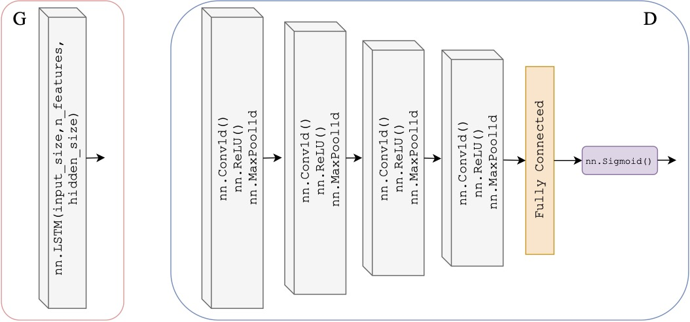
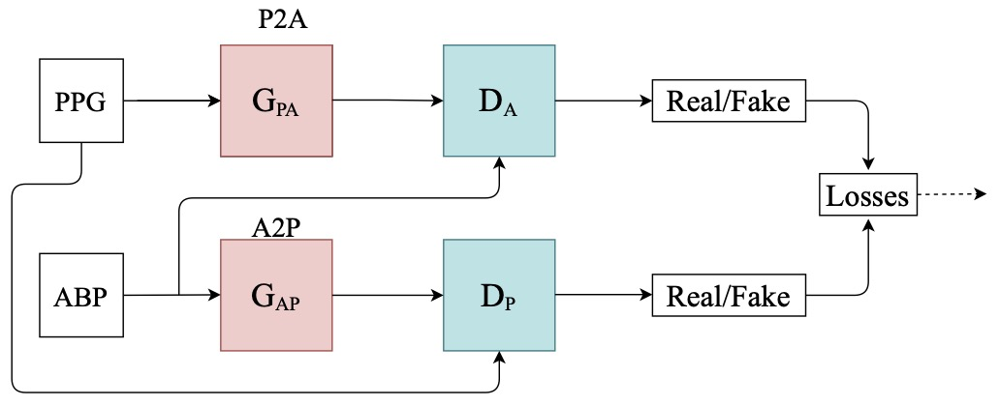
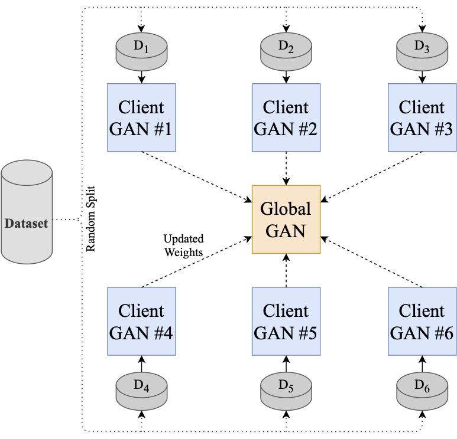
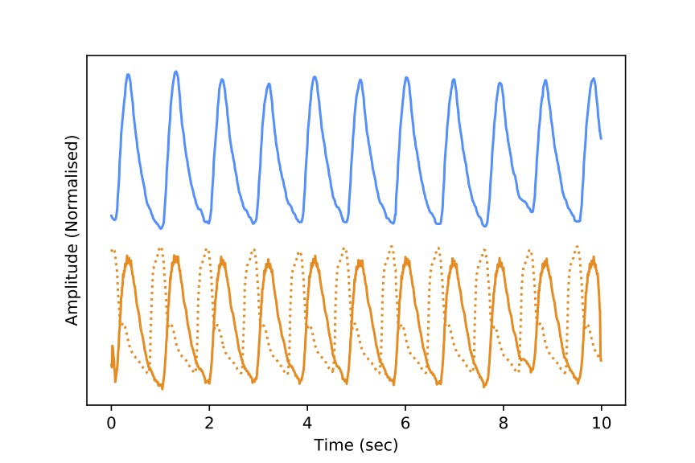

# T2TGAN
This repository is for our work submitted to ArXiv and under review at EMBC2021 titled "Estimation of Continuous Blood Pressure from PPG via a Federated Learning Approach".

We implement a framework that is capable of inferring ABP from a single optical photoplethysmogram (PPG). We train our global-model across distributed client-models and data sources to mimic a large-scale distributed collaborative learning experiment that could be implemented across low-cost wearables. Our T2TGAN can map any given time series signal to another but for the transform to make sense the signals should be correlated in some way.

GAN Architecture used in this work:

The TimeSeries-to-TimeSeries Architecture:

Federated Learning setup in this repo: 

Below is an example of the generated data: 

